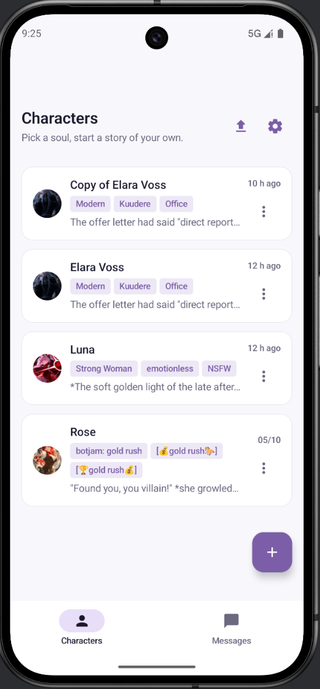
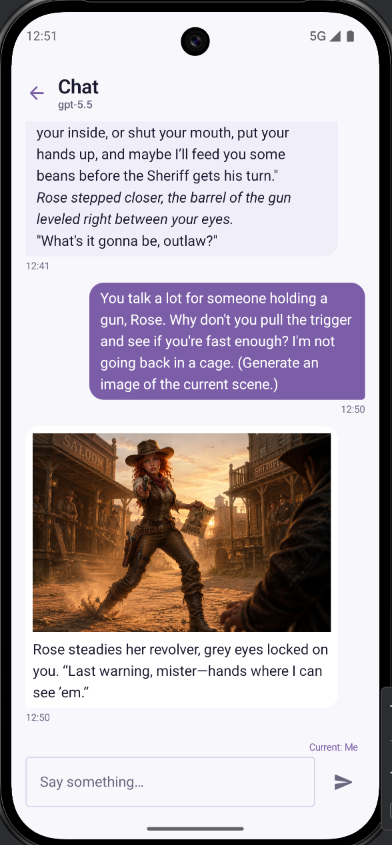
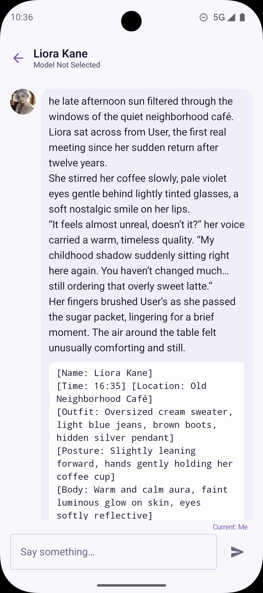

# Phantom Tavern 👻

> A local-first, native Android client for AI roleplay and storytelling.

Phantom Tavern lets you chat and roleplay with your favorite AI characters using any OpenAI-compatible API — fully offline, fully private, no subscription required.

  
  
  
  

## ✨ Features

- 👥 **Group Chat & Agentic AI** — Bring multiple characters into one room. Enable Agentic mode to watch AI characters autonomously interact and drive the plot forward!
- 🖼️ **Immersive UI & Backgrounds** — Native Android design. Set character art as your chat background for ultimate immersion.
- 🃏 **Chara Card V2** — Import/export characters from Chub.ai and other communities (JSON & PNG supported).
- 🎭 **Persona System** — Create and easily switch between multiple user identities.
- 🌍 **World Book** — Keyword-triggered lore injection for richer, consistent storytelling.
- 🎨 **Proactive AI Image Generation** — Characters can spontaneously take selfies or send images mid-conversation based on the context.
- 🧠 **Memory Search** — Semantic AI recall ensures characters remember past conversations naturally.
- ⚡ **Streaming Replies** — Real-time SSE streaming with blazing-fast generation stops.
- 🔒 **100% Local & Private** — All chats, characters, and keys are stored locally on your device. Nothing is sent to our servers.
- 🔌 **API Agnostic** — Works flawlessly with OpenRouter, DeepSeek, Claude, OpenAI, or any local LLM endpoint.

## 📥 Download

  
  

## 👥 Support & Community

- 💬 [Discord Server](https://discord.gg/8TGHZ836Pf) — Chat with the community, share character cards, and get instant help.
- ❤️ [Patreon](https://www.patreon.com/posts/phantompal-1-2-1-158396470) — Support development & get updates.
- 🐛 [Report a bug](https://github.com/Velnaris/PhantomTavern/issues/new?template=bug_report.md) — Found something broken?
- 💡 [Request a feature](https://github.com/Velnaris/PhantomTavern/issues/new?template=feature_request.md) — Have an idea?
- 🎁 [LIMITED OFFER] Want to try Phantom Tavern for FREE?
Join our Discord Server and send me a DM to claim a $10 Free API Key (Powered by ai.lebio.top, supports DeepSeek, Claude 3.5, etc. No credit card required!)

## 📋 Requirements

- Android 8.0+
- Your own API key (OpenRouter, DeepSeek, OpenAI, or any compatible endpoint)
